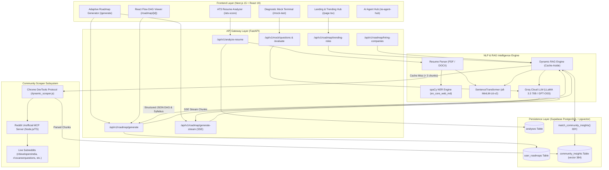

# RadarDev — SkillBridge AI

<div align="center">


<br />
**AI-Powered Career Intelligence, Hybrid ATS Scoring & Adaptive Community-Grounded Learning Roadmaps**

[](https://nextjs.org/)
[](https://react.dev/)
[](https://fastapi.tiangolo.com/)
[](https://www.python.org/)
[](https://supabase.com/)
[](https://groq.com/)
[](https://modelcontextprotocol.io/)
[](LICENSE)

[🌐 Live Web Application](https://radardev.vercel.app) • [🤖 AI Agent Hub](https://radardev.vercel.app/ai-agent-hub) • [📄 API Documentation](http://localhost:8000/docs)

</div>

---

## 📌 Executive Summary

**RadarDev (SkillBridge AI)** is an end-to-end career intelligence and adaptive learning platform. Unlike static career roadmaps or black-box AI generators that hallucinate study timelines and recommend generic curriculums, RadarDev synthesizes **live developer community discussions (Reddit)**, **deterministic NLP resume analysis**, **semantic vector search (pgvector)**, and **LLM graph synthesis (Groq)** into a personalized, real-time verifiable learning pathway.

Whether you are preparing for a career transition, aiming for Tier-1 engineering roles, or optimizing your resume for modern Applicant Tracking Systems (ATS), RadarDev provides mathematical resume evaluation, community-backed skill validation, interactive Directed Acyclic Graph (DAG) roadmaps, and terminal-based diagnostic mock interviews.

---

## 🚀 Key Features

### 1. 🎯 Deterministic & Semantic Hybrid ATS Resume Scorer
- **Multi-Factor Weighted Evaluation**: Computes scores out of 100 based on five deterministic pillars:
  $$\text{Score} = (\text{Skills \& Keywords} \times 0.40) + (\text{Content} \times 0.30) + (\text{Formatting} \times 0.15) + (\text{ATS Compatibility} \times 0.15)$$
- **Semantic Skill-to-Project Validation**: Uses `sentence-transformers/all-MiniLM-L6-v2` embeddings (cosine similarity threshold $\ge 0.6$) to verify if skills claimed in the skills section are actually substantiated in candidate projects or work history.
- **Location & Privacy Guardrails**: Employs spaCy Named Entity Recognition (`en_core_web_md` / `en_core_web_sm`) and regex patterns to flag privacy risks (street addresses, zip codes) that trigger ATS parsing penalties.
- **Fuzzy Keyword Extraction**: RapidFuzz-backed matching against custom Job Descriptions (JDs) with intelligent penalty scaling for missing core competencies.

### 2. 🌐 Live Community Intelligence (CDP + MCP Scraper)
- **Real-Time Scraping Pipeline**: Automated browser scraping via Chrome DevTools Protocol (`CHROME_CDP_URL`) and an unofficial Reddit Model Context Protocol (MCP) server.
- **Targeted Subreddit Crawling**: Mines unfiltered engineering insights from `r/developersIndia`, `r/cscareerquestions`, `r/webdev`, `r/cybersecurity`, `r/devops`, `r/interviews`, and `r/leetcode`.
- **Cache-Aside Dynamic RAG**: 
  - Hits Supabase `pgvector` for cached semantic chunks.
  - On a cache miss, triggers dynamic scraping on the fly, splits discussions into 1000-character chunks (200-char overlap), computes 384-dimensional vector embeddings, and stores them in PostgreSQL.

### 3. 🗺️ Adaptive Graph-Based Learning Roadmaps (DAG)
- **Topological Visual Roadmaps**: Rendered with `@xyflow/react` (React Flow), visualizing milestones, prerequisite chains, and difficulty tiers.
- **Mathematical Time-Budget Allocation**: Allocates total hours based on candidate's constraints ($\text{timeline\_days} \times (\text{hours\_per\_week} / 7)$) across Foundational, Core, Advanced, and Capstone tiers.
- **Live Server-Sent Events (SSE) Streaming**: Real-time progress updates stream the scraper logs, discovered subreddits, community quotes, and DAG synthesis directly to the UI.
- **Granular Study Syllabi**: Generates day-by-day study schedules, curated documentation, video tutorials, practice tasks, and milestone deliverables.

### 4. 🏢 Company Intelligence & Market Demand Discovery
- **Company Tiering Engine**: Analyzes hiring patterns across Tier 1 (FAANG/Big Tech), Tier 2 (High-growth Startups/Unicorns), and Tier 3 (Enterprise/Consulting).
- **Interview Stage Breakdown**: Details online assessments (OA), system design, live coding, and behavioral expectations based on real interview experiences shared on Reddit.

### 5. 💻 Interactive Diagnostic Mock Terminal
- **Milestone-Grounded Questions**: Generates 5 rigorous technical, scenario, and coding questions scoped strictly to the selected roadmap node and candidate difficulty.
- **Automated Diagnostic Evaluation**: Scores conceptual accuracy, edge-case coverage, and structural thinking.
- **Remedial DAG Auto-Generation**: If a candidate scores below 70%, the system automatically generates an auxiliary 3-day remedial learning DAG to bridge identified knowledge gaps.

---

## 🏗️ System Architecture



---

## 📂 Repository Structure

```
BNB-HACKATHON/
├── backend/                       # FastAPI Application Backend
│   ├── api/                       # API Route Controllers
│   │   ├── auth.py                # Optional user auth & token validation
│   │   ├── routes.py              # Resume ATS analysis endpoints
│   │   ├── routes_mock.py         # Mock interview & evaluation routes
│   │   └── routes_roadmap.py      # Roadmap generation & SSE streaming routes
│   ├── core/                      # System Configurations
│   │   └── config.py              # Environment variables, model names, weights
│   ├── database/                  # Supabase Database Client & Queries
│   │   └── supabase_db.py         # pgvector RPC calls, roadmap persistence
│   ├── models/                    # Pydantic Schemas & Data Contracts
│   │   ├── roadmap_schemas.py     # FlowNode, FlowEdge, StudyPlan models
│   │   └── schemas.py             # ATS analysis, Mock interview schemas
│   ├── services/                  # Core Business Logic & AI Engines
│   │   ├── ats_scorer.py          # Deterministic 5-factor ATS scoring engine
│   │   ├── feedback_engine.py     # Feedback, recommendations & tips generator
│   │   ├── groq_parser.py         # Groq LLM client & structured JSON extractor
│   │   ├── jd_matcher.py          # Job Description comparison & fuzzy matcher
│   │   ├── mock_engine.py         # Mock questions, evaluation & remedial DAGs
│   │   ├── rag_engine.py          # Dynamic RAG, chunking & vector search
│   │   ├── resume_analyzer.py     # Full resume analysis orchestrator
│   │   ├── resume_parser.py       # PDF/DOCX text extraction & section parser
│   │   └── roadmap_engine.py      # DAG graph layout & time-budget engine
│   ├── utils/                     # Utility helpers
│   │   ├── file_utils.py          # File parsing & text sanitization
│   │   └── matching.py            # RapidFuzz keyword matching helpers
│   ├── main.py                    # FastAPI entrypoint & model lifespan loader
│   └── requirements.txt           # Python dependencies
│
├── frontend/                      # Next.js 15 (App Router) Frontend
│   ├── src/
│   │   ├── app/                   # App Router Pages
│   │   │   ├── ai-agent-hub/      # Autonomous Agent Monitoring & Architecture
│   │   │   ├── ats-score/         # Resume Upload & ATS Score Dashboard
│   │   │   ├── generate/          # Interactive Roadmap Creation Wizard
│   │   │   ├── mock-test/         # Terminal-based Diagnostic Mock Interview
│   │   │   ├── roadmap/           # React Flow Visual DAG & Study Syllabus
│   │   │   ├── layout.tsx         # Root layout with navigation & theme providers
│   │   │   └── page.tsx           # Hero landing & dynamic trending roles
│   │   ├── components/            # Reusable UI Components
│   │   │   ├── ATSGauge.tsx       # Animated circular score visualizer
│   │   │   ├── ATSReportPrintView.tsx # Printable ATS diagnostic report
│   │   │   ├── CommunityEvidenceDrawer.tsx # Reddit citation evidence viewer
│   │   │   ├── CompanyIntelligenceCard.tsx # Company tiering & interview breakdown
│   │   │   ├── MockTerminal.tsx   # Hacker-styled interactive interview terminal
│   │   │   ├── NodeDetailsDrawer.tsx # Milestone syllabus & resource drawer
│   │   │   ├── ResearchStreamModal.tsx # SSE live scraping & synthesis logger
│   │   │   ├── RoadmapDAG.tsx     # React Flow graph canvas
│   │   │   ├── ScoreBreakdownBars.tsx # 5-factor ATS score bars
│   │   │   ├── StudyPlanView.tsx  # Day-by-day syllabus & project tracker
│   │   │   └── TrendingRolesModal.tsx # Market trends exploration modal
│   │   └── lib/
│   │       └── api.ts             # Typed API client & EventSource SSE helper
│   ├── package.json               # Frontend dependencies & scripts
│   └── tailwind.config.ts         # Tailwind CSS styling configuration
│
├── database/                      # Database Schemas & Migrations
│   ├── schema.sql                 # Supabase PostgreSQL schema with pgvector & RPC
│   ├── test_connection.py         # Supabase connection verification
│   └── test_new_functions.py      # Vector RPC matching smoke test
│
├── scraper/                       # Dynamic Community Scraping Subsystem
│   ├── dynamic_scraper.js         # CDP + MCP Reddit scraper runner
│   ├── extract_insights.py        # Batch JSON ingestion into Supabase pgvector
│   ├── scrape_and_ingest_blockchain.py # Specialized role scraper
│   └── package.json               # Scraper dependencies (@modelcontextprotocol/sdk)
│
├── reddit-unofficial-api/         # Model Context Protocol (MCP) Reddit Server
│   ├── src/                       # TypeScript MCP server implementation
│   ├── tsconfig.json              # TypeScript compilation config
│   └── package.json               # Server scripts & dependencies
│
└── .env                           # Root configuration file
```

---

## 🧮 Algorithmic & Methodological Deep Dives

### 1. ATS Scoring Mathematics & Rule Matrix

The overall ATS resume score is computed deterministically using standard recruitment rules rather than relying on inconsistent LLM ratings:

| Component | Max Points | Evaluation Strategy |
| :--- | :---: | :--- |
| **Formatting** | 20 | Detects standard sections (Experience, Education, Skills, Summary, Projects) and bullet point density. |
| **Keywords** | 25 | Tiered points for technical keyword volume + RapidFuzz matching against job description requirements. |
| **Content Quality** | 25 | Measures action verb variety, quantifiable metric density (e.g. `25%`, `$50k`, `10M requests`), and grammar penalty. |
| **Skill Validation** | 15 | **Semantic verification**: Embedding similarity ($\text{all-MiniLM-L6-v2} \ge 0.6$) verifying claimed skills inside project descriptions. |
| **ATS Compatibility** | 15 | Detects unparseable table characters, Unicode symbols, and location/privacy infractions. |

#### Penalty & Bonus Modifiers:
- **Location Privacy Penalty**: Deducts $2.0 - 5.0$ points if full street addresses or zip codes are present.
- **JD Keyword Deficit**: Deducts $5.0 - 15.0$ points if candidate lacks $> 30\%$ of required JD keywords.
- **Skill Validation Bonus**: Adds $+1.0 - 2.0$ points if $\ge 80\%$ of skills are proven through project bullet points.

---

### 2. Time-Budgeted Roadmap Scheduling

Given candidate inputs $T_{\text{days}}$ (timeline in days) and $H_{\text{week}}$ (hours per week), total study capacity $C_{\text{total}}$ is computed:
$$C_{\text{total}} = T_{\text{days}} \times \left(\frac{H_{\text{week}}}{7}\right) \text{ hours}$$

The roadmap engine segments nodes into 4 topological phases:
1. **Foundational Tier** ($15\% - 20\%$ of budget): Core syntax, fundamental CS concepts, toolchains.
2. **Core Tier** ($35\% - 45\%$ of budget): Primary frameworks, system architecture, database design.
3. **Advanced Tier** ($25\% - 30\%$ of budget): Scalability, security, CI/CD, performance tuning.
4. **Capstone Tier** ($15\% - 20\%$ of budget): Production-grade portfolio project with live deployment.

---

### 3. Vector Similarity Search (`pgvector`)

Community discussions are indexed using PostgreSQL's `pgvector` extension. Search queries execute an optimized Cosine Distance operator:

```sql
CREATE OR REPLACE FUNCTION match_community_insights(
  query_embedding  vector(384),
  target_role      TEXT,
  match_threshold  FLOAT DEFAULT 0.5,
  match_count      INT   DEFAULT 10
)
RETURNS TABLE (...) 
LANGUAGE plpgsql AS $$
BEGIN
  RETURN QUERY
  SELECT
    ci.id, ci.role, ci.subreddit, ci.post_title, ci.post_url,
    ci.author, ci.upvotes, ci.chunk_content,
    (1 - (ci.embedding <=> query_embedding))::FLOAT AS similarity
  FROM community_insights ci
  WHERE ci.role ILIKE '%' || target_role || '%'
    AND (1 - (ci.embedding <=> query_embedding)) > match_threshold
  ORDER BY ci.embedding <=> query_embedding
  LIMIT match_count;
END;
$$;
```

---

## 📡 API Reference

### 1. ATS Resume Analysis
- **`POST /api/v1/analyze-resume`**
  - **Content-Type**: `multipart/form-data`
  - **Payload**:
    - `resume`: Binary PDF / DOCX file (max 5 MB)
    - `job_description` *(optional)*: String
  - **Response**: `AnalysisResponse`
    ```json
    {
      "overall_score": 84.5,
      "component_scores": {
        "formatting": 18.0,
        "keywords": 22.0,
        "content": 21.5,
        "skill_validation": 12.0,
        "ats_compatibility": 11.0
      },
      "detected_skills": ["Python", "Docker", "PostgreSQL", "FastAPI"],
      "skill_validation_details": {
        "validated_skills": [{"skill": "Docker", "projects": ["Microservices Backend"], "similarity": 0.82}],
        "unvalidated_skills": ["Kubernetes"]
      },
      "location_privacy": {
        "privacy_risk": "high",
        "detected_locations": [{"text": "123 Main Street", "type": "address"}],
        "penalty_applied": 4.0
      }
    }
    ```

---

### 2. Roadmap Generation & Streaming
- **`POST /api/v1/roadmap/generate-stream`** (SSE)
  - **Content-Type**: `application/json`
  - **Payload**:
    ```json
    {
      "target_role": "Backend Engineer",
      "experience_level": "intermediate",
      "timeline_days": 60,
      "hours_per_week": 15,
      "known_skills": ["Python", "Git", "SQL"],
      "skills_gap": ["Redis", "Distributed Systems", "Kafka"],
      "target_company": "Uber",
      "preparation_goal": "job"
    }
    ```
  - **SSE Event Stream**:
    - `type: "status"` — Live pipeline progress log
    - `type: "community_evidence"` — Scraped Reddit citations & quotes
    - `type: "complete"` — Final `RoadmapResponse` containing `nodes`, `edges`, `study_plan`, and `company_intelligence`.

---

### 3. Diagnostic Mock Terminal
- **`POST /api/v1/mock/questions`**
  - **Payload**: `{"milestone_label": "Distributed Caching & Redis", "difficulty": "Intermediate", "target_role": "Backend Engineer"}`
  - **Response**: 5 structured scenario & technical questions with tested concepts.

- **`POST /api/v1/mock/evaluate`**
  - **Payload**: `{"milestone_label": "Distributed Caching", "difficulty": "Intermediate", "answers": [{"question_id": "q1", "answer": "..."}]}`
  - **Response**: Readiness score, strength analysis, conceptual gaps, and automatic remedial learning DAG if score $< 70\%$.

---

## ⚙️ Environment Configuration

Create a `.env` file in the root directory:

```env
# ── Server Configuration ──
ENVIRONMENT=dev
NEXT_PUBLIC_FRONTEND_URL=http://localhost:3000

# ── Supabase (Database & pgvector) ──
SUPABASE_URL=https://your-project.supabase.co
SUPABASE_KEY=your_supabase_service_role_key
SUPABASE_ANON_KEY=your_supabase_anon_key
SUPABASE_JWT_SECRET=your_jwt_secret

# ── Groq LLM ──
GROQ_API_KEY=gsk_your_groq_api_key
GROQ_MODEL=openai/gpt-oss-120b

# ── NLP & Embeddings ──
SENTENCE_TRANSFORMER_MODEL=all-MiniLM-L6-v2

# ── Community Scraper & MCP ──
ENABLE_LIVE_CDP_SCRAPER=true
CHROME_CDP_URL=http://localhost:9222
MCP_SERVER_PATH=reddit-unofficial-api/build/index.js
```

---

## 🛠️ Local Development & Quickstart

### Prerequisites
- **Node.js**: `v18.x` or `v20.x`
- **Python**: `3.11+`
- **PostgreSQL / Supabase**: Supabase instance with `pgvector` enabled.

---

### Step 1: Clone Repository
```bash
git clone https://github.com/lifewalker16/BNB-HACKATHON.git
cd BNB-HACKATHON
```

### Step 2: Set Up Database (Supabase)
1. Go to your Supabase SQL Editor.
2. Paste and run the contents of [`database/schema.sql`](file:///c:/Users/Life_Walker/Desktop/BNB-HACKATHON/database/schema.sql) to create `analyses`, `user_roadmaps`, `community_insights`, and the `match_community_insights` vector RPC.

---

### Step 3: Backend Setup
```bash
# Create and activate virtual environment
python -m venv venv
# On Windows:
.\venv\Scripts\activate
# On Unix/macOS:
# source venv/bin/activate

# Install dependencies
pip install -r backend/requirements.txt

# Download required spaCy models
python -m spacy download en_core_web_md
python -m spacy download en_core_web_sm

# Start FastAPI backend
uvicorn backend.main:app --host 0.0.0.0 --port 8000 --reload
```
API Documentation will be accessible at [http://localhost:8000/docs](http://localhost:8000/docs).

---

### Step 4: Frontend Setup
```bash
cd frontend

# Install Node dependencies
npm install

# Start Next.js development server
npm run dev
```
Open [http://localhost:3000](http://localhost:3000) in your web browser.

---

### Step 5: (Optional) Build MCP Scraper Server
```bash
cd reddit-unofficial-api
npm install
npm run build
```

---

## 🧪 Testing & Verification

The repository comes equipped with automated test scripts:

```bash
# Verify Supabase connection
python database/test_connection.py

# Verify vector similarity search RPC
python database/test_new_functions.py

# Run backend smoke tests
python backend/services/test_api_smoke.py
python backend/services/test_roadmap_smoke.py
python backend/services/test_mock_smoke.py
python backend/services/test_rag_smoke.py
```

---

## 🤝 Contributing

Contributions, issues, and feature requests are welcome!
1. Fork the Project
2. Create your Feature Branch (`git checkout -b feature/AmazingFeature`)
3. Commit your Changes (`git commit -m 'Add some AmazingFeature'`)
4. Push to the Branch (`git push origin feature/AmazingFeature`)
5. Open a Pull Request

---

## 📜 License

Distributed under the **MIT License**. See `LICENSE` for more information.

<div align="center">
Developed with ❤️ for the <b>BnB Hackathon 2026</b>
</div>
